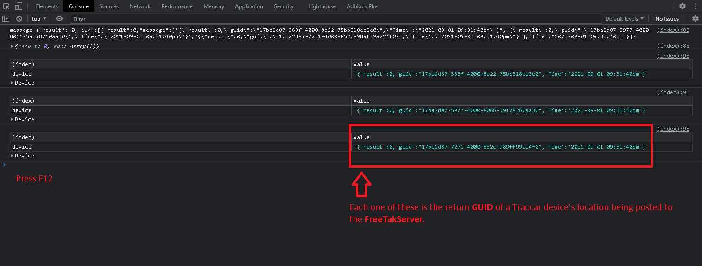

# TAKCAR

[](img/f12.png)

Quick and dirty example of importing **Traccar** `Lon`, `Lat` coordinates into the **FreeTakServer**.

On page load the script automatically begins a loop getting lat,lon from *Traccar* and posting them to *FTS*.

The `Test Service` button just tests to see that you can see a result on *FTS*.

```JSON

{   
    "uid": "999b5874-1ebf-11zz-9e70-4e58de281c19",
    "how": "nonCoT",
    "name": "POTUS",
    "longitude": -77.01385,
    "latitude": 38.889,
    "role": "Team Member",
    "team": "Yellow"
}

```

## STEPS
1. create an account and API Token in Traccar.

2. Use the `positions` endpoint in Traccar to get the *latitude* and *longitude* into vars.

```HTTP
http://127.0.0.1:8082/api/positions?token=Fm9OhNJS7SShyw80M8kdqKMcSiOuqqhA
```

3. Using the `postPresence` endpoint in the FreeTakServer Import the *latitude* and *longitude* vars into FreeTakServer.

```HTTP
http://127.0.0.1:19023/ManagePresence/postPresence
```

## Notes

The scripts assume `19023` is the *FTS* API port and that `8082` is the *Traccar* API port.

It is also assumed that the scripts are running on the same machine as *FTS* and *Traccar*.

As long as the page is open the loop will continue to run but will stop on close.
