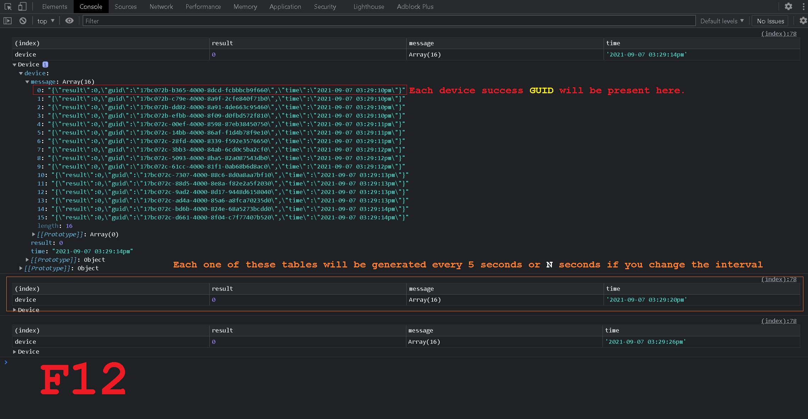
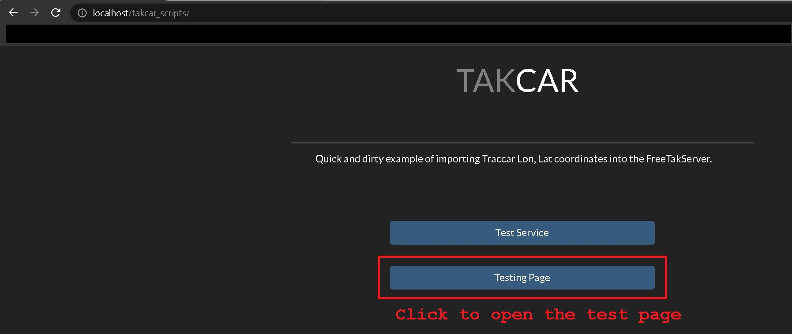
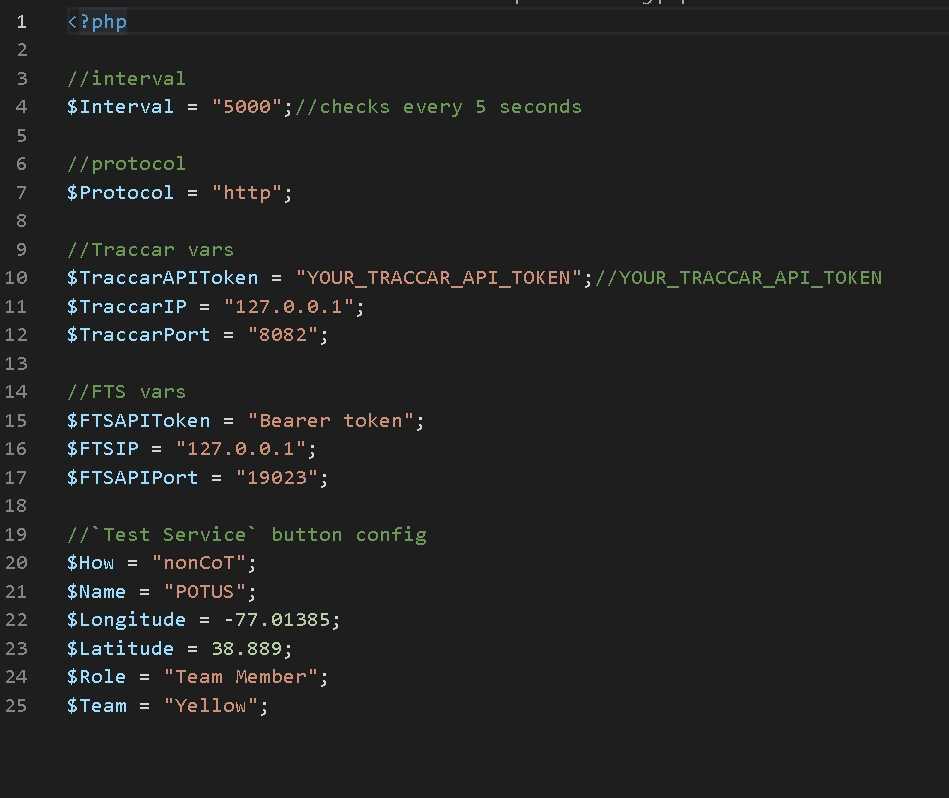
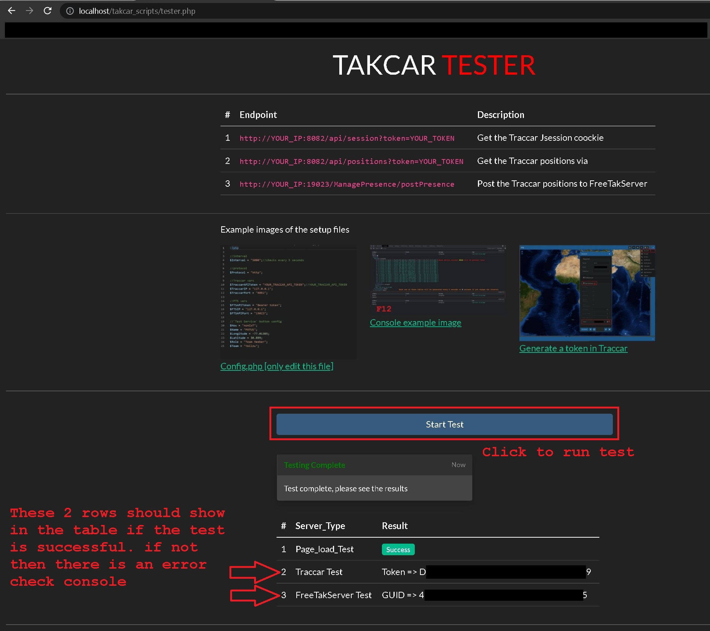
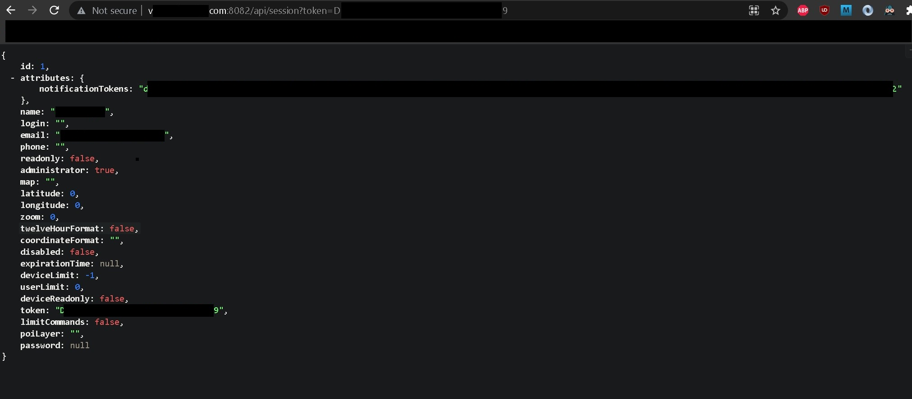
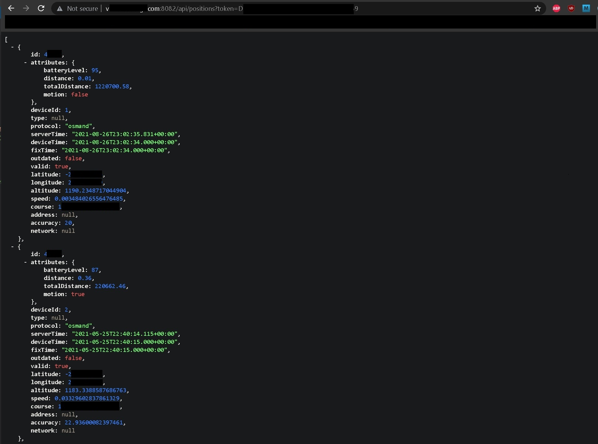

# TAKCAR

[](img/f12.jpg)

A quick example of importing **Traccar** `longitude`, `latitude` coordinates into the **FreeTakServer**.

On page load the script automatically begins a loop getting the longitude, latitude of devices from *Traccar* and posting them to *FTS*.

The `Test Service` button just tests to see that you can see a result on *FTS*.

There is also a dedicated testing page which tests the endpoints to confirm that they are reachable.

## STEPS

Once downloaded copy the folder `takcar_scripts` to your `htdocs` or equivalent folder.

Open the web page via `http://localhost/takcar_scripts/`.

### 1.

Make sure that `Traccar` and `FreeTakServer` are running.

Make sure that all your EUD's are connected to the FreeTakServer.

Make sure you have an *Apache distribution* I use the XAMPP system however any system that has `PHP` will suffice.

https://www.apachefriends.org/download.html

[](img/index.jpg)

### 2.

Open the `config.php` file and replace the variables with your `Traccar` and `FreeTakServer` variables.

Both the `Traccar` and `FreeTakServer` softwares must be running.

If you are running the servers over the internet you will need to port forward the appropriate ports to allow the endpoint connections.

The current `XMLHttpRequest();` should not show any general errors or **CORS** policy errors.

[](img/config.jpg)

### 3.

Open the testing page and click on the `Start Test` button to test the endpoints.

[](img/tester.jpg)

### 4.

Once you have confirmed that the endpoints are communicating you can open `index.php` on your machine via `localhost`.

### 5.

Now that everything is up and running the `Test Service` button can be clicked to immediately test a `postPresence` position on FTS.

The loop will continue to run as long as the webpage is open.

*getPositions* `Traccar` endpoint example.

```HTTP
http://127.0.0.1:8082/api/positions?token=Your_Token_Here
```

*postPresence* `FreeTakServer` endpoint example.

```HTTP
http://127.0.0.1:19023/ManagePresence/postPresence
```

I also added the function of posting RAW COT data via TCP on port `8087` via a PHP socket.

`get_FTSSOCKET`

```XML
<?xml version="1.0" encoding="UTF-8"?>
<event version="2.0" uid="S-1-5-21-1568504889-667903775-1938598950-id" type="a-f-G-U-C-I" time="time" start="time" stale="time+5" how="h-g-i-g-o">
   <point lat="latitude" lon="longitude" hae="0" ce="9999999" le="9999999" />
   <detail>
      <takv version="4.1.0.231" platform="WinTAK-CIV" os="Microsoft Windows 10 Pro" device="System manufacturer System Product Name" />
      <contact callsign="callsign_id" endpoint="*:-1:stcp" />
      <uid Droid="Droid_id" />
      <__group name="Red" role="Team Member" />
      <status battery="100" />
      <track course="0.00000000" speed="0.00000000" />
   </detail>
</event>
```

`get_FTSSOCKETPING`

```XML
<?xml version="1.0" encoding="UTF-8"?>
<event version="2.0" uid="S-1-5-21-1568504889-667903775-1938598950-id-ping" type="t-x-c-t" time="time" start="time" stale="time+5" how="m-g">
   <point lat="latitude" lon="longitude" hae="0.00000000" ce="9999999" le="9999999" />
   <detail />
</event>
```


## Notes

The scripts assume `19023` is the *FTS* API port and that `8082` is the *Traccar* API port.

It is also assumed that the scripts are running on the same machine as *FTS* and *Traccar*.

As long as the page is open the loop will continue to run but will stop on close.

## Traccar JSON examples

[](img/session.jpg)

[](img/positions.jpg)

> FreeTAKTeam https://github.com/FreeTAKTeam

> Checkout my tutorials https://tutorials.techrad.co.za/2021/04/13/freetakserver-manager

> Video demonstration https://www.youtube.com/watch?v=KvzcrZlr9bU

> Source code https://github.com/Cale-Torino/Takcar
